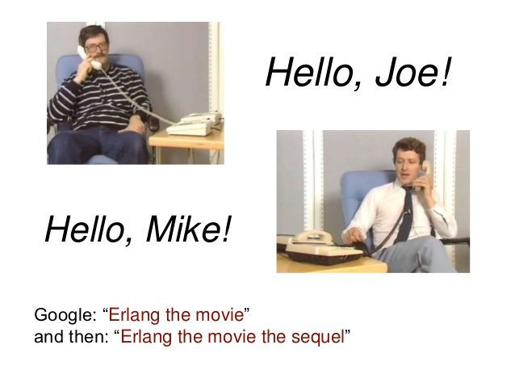
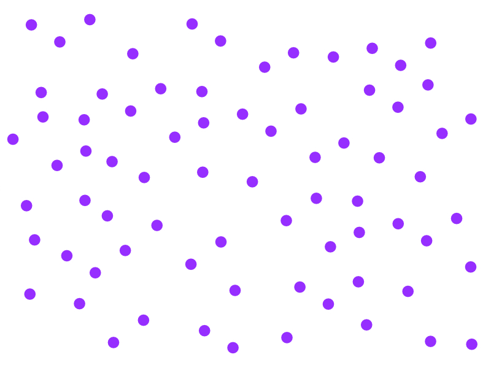
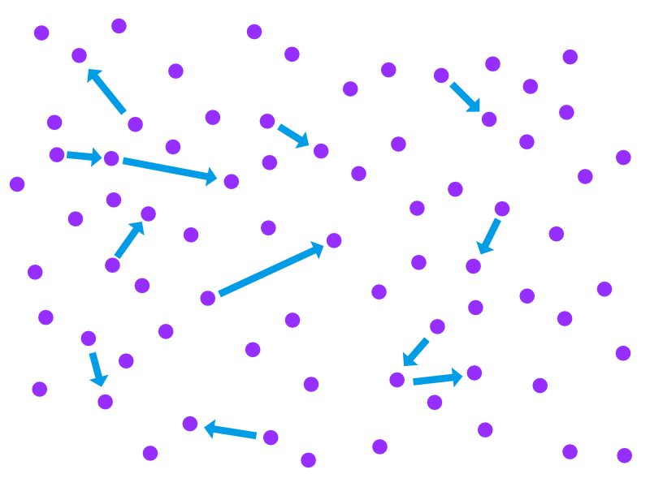
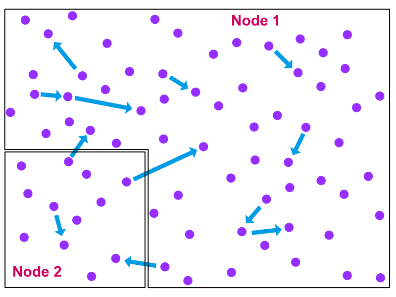

footer: Mickey Chen |> Elixir.Tw
slidenumbers: true

# Taste the Elixir
### A brief intro to Elixir & it's Ecosystem

---

# Different Angles

- The Language
- The BEAM
- The Ecosystem

---

# The Language

---

## Elixir is Readable

Ruby-like Syntax

```elixir
defmodule Demo do
  def hello(name) do
    "Hello, #{name}"
  end
end
```

---

## Elixir is Functional

---

## Elixir is Functional

### But, what does it mean for a language to be functional?

---

Taian's take on being functional

1. First Class & Lambda Functions
2. Pattern Matching
3. Lazy Evaluation
4. Immutability
5. Tail Call Optimization
6. Curry & Partial Application

---

Taian's take on being functional

1. First Class & Lambda Functions
2. Pattern Matching
3. *Some Lazy Evaluation*
4. Immutability
5. Tail Call Optimization
6. ~~Curry & Partial Application~~

---


### Let's use Fib as example

0, 1, 1, 2, 3, 5, 8, 13, 21, 34, 55...

---

### Rules of Fibonacci Sequence

$$ F_0 = 0 $$

$$ F_1 = 1 $$

$$ F_n = F_{n-1} + F_{n-2} $$

---

### ... now in Elixir

```elixir
defmodule Fib do
  def calc(0), do: 0
  def calc(1), do: 1
  def calc(n), do: calc(n-1) + calc(n-2)
end

10
|> Fib.calc()
|> IO.inspect()

# 55
```

^ Function 1st
Pattern Matching
Pipes

---

## Elixir is Extensible

Powerful Macros System "Borrowed" from LISPS (Clojure)

---


### Elixir is written in Elixir!

---

#[fit] The Björn's **Erlang** Abstract Machine
#### (or we can just call it "BEAM")

---

- 36 years old

- Made for Telephone Switches



---

## BEAM was created to solve...

- Distribution
- Fault Tolerant
- Soft Real-Time
- Long Running
- Hot Swappable

---

### Everything is a process



^
isolated
lightweight

---

### Communicate by Sending Messages



^
Pragmatic Actor Pattern
simple recovery and gc

---

### ...and your company started to grow



---

## It's hard to use all your cores :(


^
Moore's Law is Ending
BEAM > Concurrency is just a special case of Distribution

---

## WhatsApp's 2M Connection on A Server

before it was sold to Facebook...

- 35 engineer
- 450M Users
- Sold for $19B

^
55 Eng for 1B+ Monthly active users @ 2015

---

# The Ecosystem

---

## Good at

- Light Computational Tasks
- Long Running Services
- Things that need to Scale
- Stateful Communication

---

## Bad at

- CPU Intensive Tasks

<sub>Workaround: Port and NIF</sub>

^
Scheduler Overhead
etc. Coin minning, Live Media Frame by Frame Processing, Building AI model

---

### Name a Few Use Cases
- Web Services (Phoenix)
- GraphQL Server (Absinthe)
- IoT (NERVES)
- Server-rendered SPA (Phoenix LiveView)

---

# DEMO Time! 🤞

---

## About Me


- Everywhere: @yuchunc
- Elixir.Tw founder & organizer

---

# Thank You!
