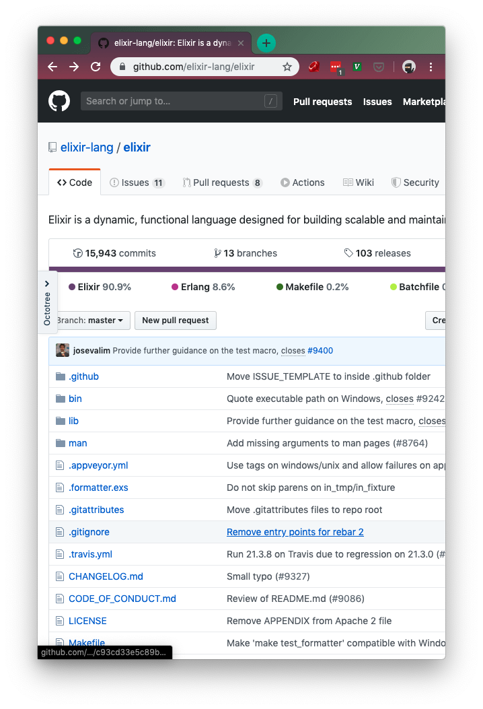

footer: Mickey Chen |> Elixir.Tw
slidenumbers: true

# Taste the Elixir
### A brief intro to Elixir & it's Ecosystem

---

# Different Angles

- The Language
- The BEAM
- The Ecosystem

---

# The Language

---

## Elixir is Readable

Ruby-like Syntax

```elixir
defmodule Demo do
  def hello(name) do
    "Hello, #{name}"
  end
end
```

---

## Elixir is Functional

0, 1, 1, 2, 3, 5, 8, 13, 21, 34, 55...

---

### Rules of Fibonacci Sequence

$$ F_0 = 0 $$

$$ F_1 = 1 $$

$$ F_n = F_{n-1} + F_{n-2} $$

---

### ... now in Elixir

```elixir
defmodule Fib do
  def calc(0), do: 0
  def calc(1), do: 1
  def calc(n), do: calc(n-1) + calc(n-2)
end

10
|> Fib.calc()
|> IO.inspect()

# 55
```

---

## Elixir is Extensible

Powerful Macros System "Borrowed" from LISPS (Clojure)

---

### Elixir is written in Elixir


